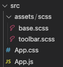
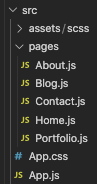
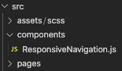
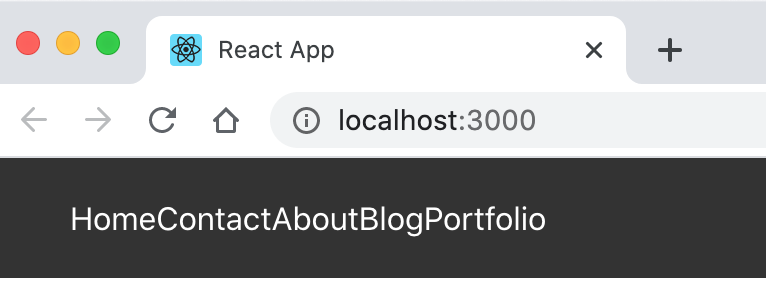

React Responsive Navbar Menu

#### Project Setup

1) Create React project using yarn

~~~ bash
yarn create react-app 
~~~

2) Create the following directory/file structure

    

3) Add these imports

   - within `base.css` add

   ~~~ scss
   @import './toolbar.scss';
   ~~~

   - within `index.js` add

   ~~~ js
   import './assets/scss/base.scss';
   ~~~

4) Add  <a href = "https://reach.tech/router"> Reach Router</a> & <a href = "https://github.com/sass/node-sass"> node-sass </a>

    - install

    ~~~ bash
    yarn add @reach/router node-sass
    ~~~

    - add import to `App.js`

    ~~~ js
    import React from 'react';
    import {Router} from '@reach/router'
    ~~~

#### Set up pages and routes

1) Add `navlinks` to `App.js`

    ~~~ js
    function App() {
        const navLinks = [
                {   
                    text: 'Home',
                    path: '/',
                    icon: 'ion-ios-home',
                },
                {
                    text: 'Contact',
                    path: '/contact',
                    icon: 'ion-ios-megaphone',
                },
                {
                    text: 'About',
                    path: '/about',
                    icon: 'ion-ios-business'
                },
                {
                    text: 'Blog',
                    path: '/blog',
                    icon: 'ion-ios-bonfire',
                },
                {
                    text: 'Portfolio',
                    path: '/portfolio',
                    icon: 'ion-ios-briefcase',
                }    
        ]
    ~~~

2) Create directory/file structure for pages  

    

3) Add pages (variations of class & functional components are used)

   - `About.js`

   ~~~ js
   import React, {Component} from 'react';

   class About extends Component {

       render() {

           return (
               
 About 

           )
       }

   }

   export default About
   ~~~

   - `Blog`

    ~~~ js
    import React from 'react';

    class Blog extends React.Component {

        render() {

            return (
                
 Blog page 

            )
        }

    }

    export default Blog
    ~~~

   - `Contact`    

   ~~~ js
   import React from 'react';

   export const Contact = () => {

       return (
           
 Contact page 

       )

   }
   ~~~

   - Home 

   ~~~ js
   import React from 'react';

   const Home = () => {

       return (
           
 Home 

       )
   }

   export default Home
   ~~~

   - `Portfolio`

   ~~~ js
   import React from 'react';

   export default function Portfolio() {

       return (
           
 Portfolio 

       )

   }
   ~~~

4) Add imports for pages

    ~~~ js
    import About from './pages/About';
    import Blog from './pages/Blog';
    import Contact from './pages/Contact';
    import Home from './pages/Home';
    import Portfolio from './pages/Portfolio';
    ~~~

5) Run `yarn start` and verify that pages show up when path typed into browser (e.g. http://localhost:3000/home)

#### Build Responsive Navigation
##### Part 1
1) Build `ResponseNavigation` directory/file structure

    

2) Add to `App.js`

   - add import

   ~~~ js 
   import ResponsiveNavigation from './components/ResponsiveNavigation'
   ~~~

   - add to `return`

   ~~~ js
   return (
       

           <ResponsiveNavigation
               navLinks = {navLinks}
               logo = {logo}
               background = "#eee"
               hoverBackground = "#ddd"
               linkColor = "#888"

           />

           <Router>
   ~~~

3) Create initial `ResponsiveNavigation` component to render props

    ~~~ js
    import React, {useState} from 'react';
    import {Link} from '@reach/router';

    function ResponsiveNavigation({navLinks, background, hoverBackground, linkColor, logo}) {
        // Add Hooks to manage hoverIndex
        const [hoverIndex, setHoverIndex] = useState(-1) // default state is -1
        const [navOpen, setNavOpen] = useState(false)

        return(
            <nav
                className = 'responsive-toolbar'
                style = {{ background}}
            > {/* // outside {} is for JSX, inside {} is to return object */}
                <ul 
                    style = {{background}}
                    className = {navOpen ? 'active' : ''}
                >
                    {navLinks.map((link) => 
                        <li>
                            <Link
                                to = {link.path}
                                style = {{ color: linkColor}}
                            >
                                {link.text}
                            </Link>    
                        
                        </li>    
                    )}
                </ul>
            </nav>
        )

    }

    export default ResponsiveNavigation
    ~~~

4) Add basic styling to `toolbar.scss`

    ~~~ scss
    nav.responsive-toolbar {
        background: #333333;
        height: 60px;
        width: 100%;
        position: fixed;

        ul {
            background: #333333;
            display: flex;
            margin-block-start: 0;
            margin-block-end: 0;
            padding-inline-start: 0;
            height: 100%;
            align-items: center;

            li {
                list-style-type: none;
                margin: 20px 10px;
            }
            
            a {
                color: white;
                text-decoration: none;
            }
        }

    }
    ~~~

5) Fix page text from being covered up by nav bar
   - The `position: fixed` will cover up the basic text on each page
  
    ~~~ scss
        div.page-offset {
            padding-top: 80px;
        }
    ~~~

   - push the content down using padding an add the class to each div tag

    ~~~ js
        

    ~~~

6) Run `yarn start` to verify layout
   
    

##### Part 2

1) Import `ionicons` inside of `base.scss`

    ~~~ scss 
    @import url('https://unpkg.com/ionicons@4.2.2/dist/css/ionicons.min.css');
    ~~~

 2) Add icons to `Link` within `ResponsiveNavigation.js`

    ~~~ js
    <Link
        to = {link.path}
        style = {{ color: linkColor}}
    >
        {link.text}
        <i className = {link.icon}/>
    </Link>  
    ~~~

3) To put icons before the link text, use flex and add styling to the icon

    ~~~ scss
        li {
        list-style-type: none;
        padding: 10px 20px;
        }

        a {
        color: white;
        text-decoration: none;
        display: flex;
        flex-direction: row-reverse;
        align-items: center;
        }

        i {
        margin-right: 5px;
        font-size: 20px;
        }
    ~~~

4) To add hover styling
   - add `link` to map parameters
   - use anonymous functions to set hover index and add styling

    ~~~ js
        {navLinks.map((link, index) => 
            <li
                onMouseEnter = { () => setHoverIndex(index)}
                onMouseLeave = { () => setHoverIndex(-1)}
                style = {{background: hoverIndex === index ? (hoverBackground || '#999') : ''}}
            >
    ~~~

5) Add `figure` to `ResposiveNavigation.js` 

    - `figure` is `Semantic HTML` and is used to specify self-contained content improves accessibility
    - in this case, it encloses the `logo` image that toggles the opening/closing of a nav menu opening/closing 
         
    ~~~ js
        <figure className = "image-logo"
        onClick = { () => {setNavOpen(!navOpen)}}
        >
        
        </figure>
    ~~~

6) Add styling for figure in `toolbar.scss`
   - `cursor: pointer` changes mouse behavior when hovering over logo, suggesting that a mouse click may open a menu
    ~~~ scss
        figure {
        margin-block-start: 0;
        margin-block-end: 0;
        margin-inline-start: 10px;
        margin-inline-end: 0;
        cursor: pointer;
        }
    ~~~

##### part 3

1) Add media query into `toolbar.scss`

- notice how the `ul` changes `flex-direction` to column
- the icons are switched around so appear on the right

    ~~~ scss
        @media screen and (max-width: 759px) {
            nav.responsive-toolbar {
                ul {
                    height: 100%;
                    width: 200px;
                    position: fixed;
                    left: -140px;
                    top: 60px;
                    flex-direction: column;

                    figure {
                        margin-inline-start: 2px;
                        position: fixed;
                        left: 10px;
                        top: 10px;
                    }

                    li {
                        width: 100%;
                        padding-left: 0;
                        padding-right: 0;
                    }

                    a {
                        flex-direction: row;
                        justify-content: space-between;
                        margin-left: 20px;
                        margin-right: 16px;
                    }
                }

            }

            div.page-offset {
                padding-left: 80px;
            }
        }
    ~~~
    
2) Add a box-shadow

~~~ scss
nav.responsive-toolbar {
    background: #333333;
    height: 60px;
    width: 100%;
    position: fixed;
    box-shadow: 2px 0px 2px #ccc;

    ul {
        background: #333333;
        display: flex;
        margin-block-start: 0;
        margin-block-end: 0;
        padding-inline-start: 0;
        height: 100%;
        align-items: center;
        box-shadow: 2px 2px 2px #ccc;
~~~

3) Create menu box that opens

   - add transition & active class attributes

   ~~~ scss
   @media screen and (max-width: 759px) {
       nav.responsive-toolbar {
           ul {
               height: 100%;
               width: 200px;
               position: fixed;
               left: -140px;
               top: 60px;
               flex-direction: column;
               transition: 300ms ease all;

               &.active {
                   left: 0px;
               }
   ~~~

4) Added img toggle when menu opened
- import hamburger image

~~~ js
import burger from './burger.png';
~~~

- add some logic to toggle `src = {img}` used within `figure`

~~~ js
let img = logo;
{navOpen ? img = logo : img = burger}

....

~~~